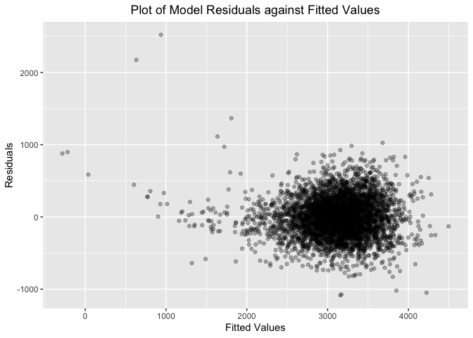
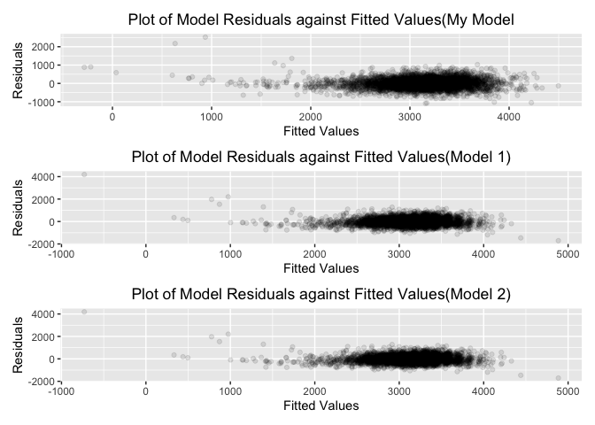
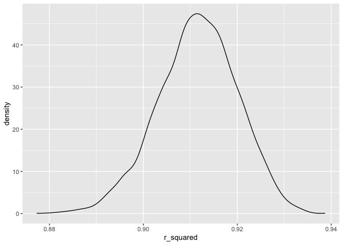
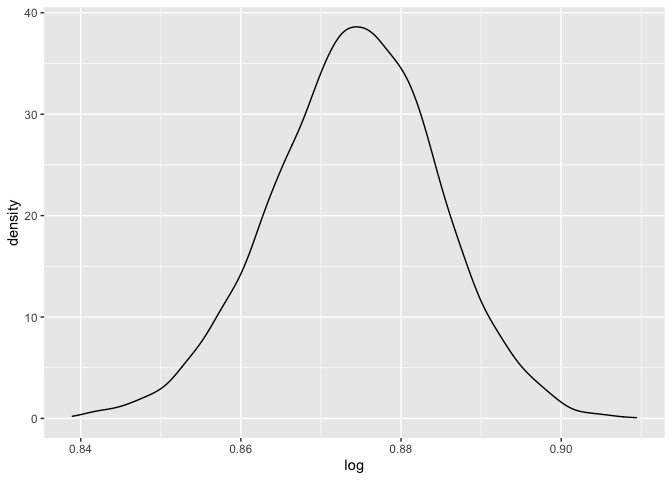

p8105\_hw6\_cw3370.Rmd
================

# Problem 1

**Load and clean the data for regression analysis (i.e. convert numeric
to factor where appropriate, check for missing data, etc.).**

Data Description

``` r
birthweight <- read_csv("data/birthweight.csv")  
```

    ## Rows: 4342 Columns: 20

    ## ── Column specification ────────────────────────────────────────────────────────
    ## Delimiter: ","
    ## dbl (20): babysex, bhead, blength, bwt, delwt, fincome, frace, gaweeks, malf...

    ## 
    ## ℹ Use `spec()` to retrieve the full column specification for this data.
    ## ℹ Specify the column types or set `show_col_types = FALSE` to quiet this message.

``` r
skimr::skim(birthweight)
```

|                                                  |             |
|:-------------------------------------------------|:------------|
| Name                                             | birthweight |
| Number of rows                                   | 4342        |
| Number of columns                                | 20          |
| \_\_\_\_\_\_\_\_\_\_\_\_\_\_\_\_\_\_\_\_\_\_\_   |             |
| Column type frequency:                           |             |
| numeric                                          | 20          |
| \_\_\_\_\_\_\_\_\_\_\_\_\_\_\_\_\_\_\_\_\_\_\_\_ |             |
| Group variables                                  | None        |

Data summary

**Variable type: numeric**

| skim\_variable | n\_missing | complete\_rate |    mean |     sd |     p0 |     p25 |     p50 |     p75 |   p100 | hist  |
|:---------------|-----------:|---------------:|--------:|-------:|-------:|--------:|--------:|--------:|-------:|:------|
| babysex        |          0 |              1 |    1.49 |   0.50 |   1.00 |    1.00 |    1.00 |    2.00 |    2.0 | ▇▁▁▁▇ |
| bhead          |          0 |              1 |   33.65 |   1.62 |  21.00 |   33.00 |   34.00 |   35.00 |   41.0 | ▁▁▆▇▁ |
| blength        |          0 |              1 |   49.75 |   2.72 |  20.00 |   48.00 |   50.00 |   51.00 |   63.0 | ▁▁▁▇▁ |
| bwt            |          0 |              1 | 3114.40 | 512.15 | 595.00 | 2807.00 | 3132.50 | 3459.00 | 4791.0 | ▁▁▇▇▁ |
| delwt          |          0 |              1 |  145.57 |  22.21 |  86.00 |  131.00 |  143.00 |  157.00 |  334.0 | ▅▇▁▁▁ |
| fincome        |          0 |              1 |   44.11 |  25.98 |   0.00 |   25.00 |   35.00 |   65.00 |   96.0 | ▃▇▅▂▃ |
| frace          |          0 |              1 |    1.66 |   0.85 |   1.00 |    1.00 |    2.00 |    2.00 |    8.0 | ▇▁▁▁▁ |
| gaweeks        |          0 |              1 |   39.43 |   3.15 |  17.70 |   38.30 |   39.90 |   41.10 |   51.3 | ▁▁▂▇▁ |
| malform        |          0 |              1 |    0.00 |   0.06 |   0.00 |    0.00 |    0.00 |    0.00 |    1.0 | ▇▁▁▁▁ |
| menarche       |          0 |              1 |   12.51 |   1.48 |   0.00 |   12.00 |   12.00 |   13.00 |   19.0 | ▁▁▂▇▁ |
| mheight        |          0 |              1 |   63.49 |   2.66 |  48.00 |   62.00 |   63.00 |   65.00 |   77.0 | ▁▁▇▂▁ |
| momage         |          0 |              1 |   20.30 |   3.88 |  12.00 |   18.00 |   20.00 |   22.00 |   44.0 | ▅▇▂▁▁ |
| mrace          |          0 |              1 |    1.63 |   0.77 |   1.00 |    1.00 |    2.00 |    2.00 |    4.0 | ▇▇▁▁▁ |
| parity         |          0 |              1 |    0.00 |   0.10 |   0.00 |    0.00 |    0.00 |    0.00 |    6.0 | ▇▁▁▁▁ |
| pnumlbw        |          0 |              1 |    0.00 |   0.00 |   0.00 |    0.00 |    0.00 |    0.00 |    0.0 | ▁▁▇▁▁ |
| pnumsga        |          0 |              1 |    0.00 |   0.00 |   0.00 |    0.00 |    0.00 |    0.00 |    0.0 | ▁▁▇▁▁ |
| ppbmi          |          0 |              1 |   21.57 |   3.18 |  13.07 |   19.53 |   21.03 |   22.91 |   46.1 | ▃▇▁▁▁ |
| ppwt           |          0 |              1 |  123.49 |  20.16 |  70.00 |  110.00 |  120.00 |  134.00 |  287.0 | ▅▇▁▁▁ |
| smoken         |          0 |              1 |    4.15 |   7.41 |   0.00 |    0.00 |    0.00 |    5.00 |   60.0 | ▇▁▁▁▁ |
| wtgain         |          0 |              1 |   22.08 |  10.94 | -46.00 |   15.00 |   22.00 |   28.00 |   89.0 | ▁▁▇▁▁ |

``` r
birthweight_df <- 
  birthweight %>% 
  mutate(
    babysex = factor(babysex,
                     levels = c(1,2),
                     labels = c("male","female")),
    frace = factor(frace,
                   levels = c(1,2,3,4,8,9),
                   labels = c("White","Black","Asian","Puerto Rican","Other","Unkown")),
    malform = factor(malform,
                     levels = c(0,1),
                     labels = c("absense","present")),
    mrace = factor(mrace,
               levels = c(1,2,3,4,8),
               labels = c("White","Black","Asian","Puerto Rican","Other"))
) %>% 
  drop_na()
```

**Propose a regression model for birthweight. This model may be based on
a hypothesized structure for the factors that underly birthweight, on a
data-driven model-building process, or a combination of the two.
Describe your modeling process and show a plot of model residuals
against fitted values – use add\_predictions and add\_residuals in
making this plot.**

l used backward elimination to get the model, the variable are babysex,
bhead, blength, delwt, fincome, gaweeks, mheight, ppwt, smoken

``` r
mult.fit = lm(bwt ~ ., data = birthweight_df)
summary(mult.fit)

step1 = update(mult.fit, . ~ . -frace)
summary(step1)

step2 = update(step1, . ~ . -malform)
summary(step2)

step3 = update(step2, . ~ . -ppbmi)
summary(step3)

step4 = update(step3, . ~ . -momage)
summary(step4)

step5 = update(step4, . ~ . -menarche)
summary(step5)

step6 = update(step5, . ~ . -mrace)
summary(step6)

step7 = update(step6, . ~ . -pnumlbw)
summary(step7)

step8 = update(step7, . ~ . -pnumsga)
summary(step8)

step9 = update(step8, . ~ . -wtgain)
summary(step9)

step10 = update(step9, . ~ . -parity)
summary(step10)
```

``` r
fit <- lm(bwt ~ babysex + bhead + blength + delwt + fincome + gaweeks + mheight + ppwt + smoken, data =birthweight_df)

birthweight_df %>%
  modelr::add_residuals(fit) %>%
  modelr::add_predictions(fit) %>%
  ggplot(aes(x = pred, y = resid)) +
  geom_point(alpha = 0.3)
```

<!-- -->

``` r
cv_df = 
  crossv_mc(birthweight_df, 100) %>% 
  mutate(
    train = map(train, as_tibble),
    test = map(test, as_tibble)) %>% 
  mutate(
    my_mod         = map(train, ~lm(bwt ~ babysex + bhead + blength + delwt + fincome + gaweeks + mheight + ppwt + smoken, data = .x)),
    bl_ga_mod      = map(train, ~lm(bwt ~ blength + gaweeks, data = .x)),
    bh_bl_sex_mod  = map(train, ~lm(bwt ~ bhead + blength + babysex + bhead*blength + bhead*babysex + blength*babysex + bhead*blength*babysex, data = .x)) 
    ) %>% 
  mutate(
    rmse_my        = map2_dbl(my_mod        , test, ~rmse(model = .x, data = .y)),
    rmse_bl_ga     = map2_dbl(bl_ga_mod     , test, ~rmse(model = .x, data = .y)),
    rmse_bh_bl_sex = map2_dbl(bh_bl_sex_mod , test, ~rmse(model = .x, data = .y))
    )

cv_df %>% 
  select(starts_with("rmse")) %>% 
  pivot_longer(
    everything(),
    names_to = "model", 
    values_to = "rmse",
    names_prefix = "rmse_") %>% 
  mutate(model = fct_inorder(model)) %>% 
  ggplot(aes(x = model, y = rmse)) + geom_violin()
```

<!-- -->

# Problem 2

``` r
weather_df = 
  rnoaa::meteo_pull_monitors(
    c("USW00094728"),
    var = c("PRCP", "TMIN", "TMAX"), 
    date_min = "2017-01-01",
    date_max = "2017-12-31") %>%
  mutate(
    name = recode(id, USW00094728 = "CentralPark_NY"),
    tmin = tmin / 10,
    tmax = tmax / 10) %>%
  select(name, id, everything())
```

    ## Registered S3 method overwritten by 'hoardr':
    ##   method           from
    ##   print.cache_info httr

    ## using cached file: ~/Library/Caches/R/noaa_ghcnd/USW00094728.dly

    ## date created (size, mb): 2021-09-09 10:44:54 (7.599)

    ## file min/max dates: 1869-01-01 / 2021-09-30

``` r
get_r <- function(fit){
  r <- 
    fit %>% 
    broom::glance() %>% 
    pull(r.squared)
  
  return(r)
}

get_log <- function(fit){
  estimate = 
  fit %>% 
    broom::tidy() %>% 
    pull(estimate)
  
  log = log10(prod(estimate) )
  
  return(log)
}

boot_straps <-  
  weather_df %>% 
  modelr::bootstrap(n = 5000) %>% 
  mutate(
    models = map(strap, ~lm(tmax ~ tmin, data = .x) ),
    r_squared = unlist(map(models,get_r)),
    log = unlist(map(models,get_log))
  ) %>% 
  select(-strap,-models)

boot_straps %>% 
  ggplot(aes(x = r_squared))+
  geom_density()
```

<!-- -->

``` r
boot_straps %>% 
  ggplot(aes(x = log))+
  geom_density()
```

<!-- -->

``` r
boot_straps %>% 
  summarize(
    r_low = quantile(r_squared,probs = c(0.025)),
    r_high = quantile(r_squared,probs = c(0.0975))
  ) %>% 
  knitr::kable()
```

|    r\_low |   r\_high |
|----------:|----------:|
| 0.8939115 | 0.9005186 |

``` r
boot_straps %>% 
  summarize(
    r_low = quantile(log,probs = c(0.025)),
    r_high = quantile(log,probs = c(0.0975))
  )%>% 
  knitr::kable()
```

|    r\_low |   r\_high |
|----------:|----------:|
| 0.8531318 | 0.8604693 |
