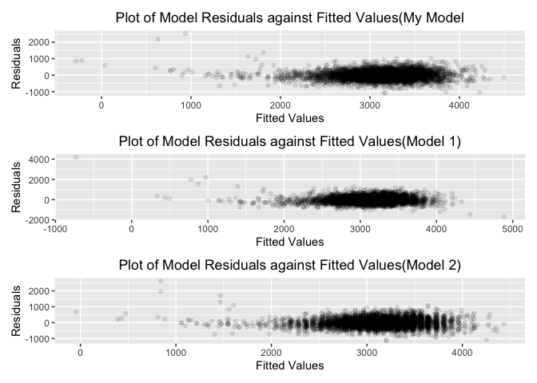
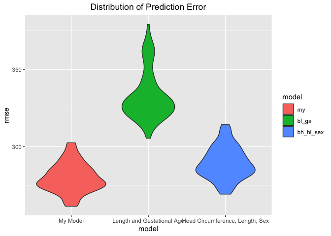
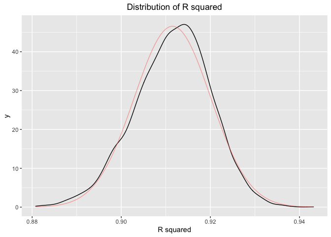

p8105\_hw6\_cw3370.Rmd
================

# Problem 1

**Load and clean the data for regression analysis (i.e. convert numeric
to factor where appropriate, check for missing data, etc.).**

Data Description

``` r
birthweight <- read_csv("data/birthweight.csv")  
skimr::skim(birthweight)
```

|                                                  |             |
|:-------------------------------------------------|:------------|
| Name                                             | birthweight |
| Number of rows                                   | 4342        |
| Number of columns                                | 20          |
| \_\_\_\_\_\_\_\_\_\_\_\_\_\_\_\_\_\_\_\_\_\_\_   |             |
| Column type frequency:                           |             |
| numeric                                          | 20          |
| \_\_\_\_\_\_\_\_\_\_\_\_\_\_\_\_\_\_\_\_\_\_\_\_ |             |
| Group variables                                  | None        |

Data summary

**Variable type: numeric**

| skim\_variable | n\_missing | complete\_rate |    mean |     sd |     p0 |     p25 |     p50 |     p75 |   p100 | hist  |
|:---------------|-----------:|---------------:|--------:|-------:|-------:|--------:|--------:|--------:|-------:|:------|
| babysex        |          0 |              1 |    1.49 |   0.50 |   1.00 |    1.00 |    1.00 |    2.00 |    2.0 | ▇▁▁▁▇ |
| bhead          |          0 |              1 |   33.65 |   1.62 |  21.00 |   33.00 |   34.00 |   35.00 |   41.0 | ▁▁▆▇▁ |
| blength        |          0 |              1 |   49.75 |   2.72 |  20.00 |   48.00 |   50.00 |   51.00 |   63.0 | ▁▁▁▇▁ |
| bwt            |          0 |              1 | 3114.40 | 512.15 | 595.00 | 2807.00 | 3132.50 | 3459.00 | 4791.0 | ▁▁▇▇▁ |
| delwt          |          0 |              1 |  145.57 |  22.21 |  86.00 |  131.00 |  143.00 |  157.00 |  334.0 | ▅▇▁▁▁ |
| fincome        |          0 |              1 |   44.11 |  25.98 |   0.00 |   25.00 |   35.00 |   65.00 |   96.0 | ▃▇▅▂▃ |
| frace          |          0 |              1 |    1.66 |   0.85 |   1.00 |    1.00 |    2.00 |    2.00 |    8.0 | ▇▁▁▁▁ |
| gaweeks        |          0 |              1 |   39.43 |   3.15 |  17.70 |   38.30 |   39.90 |   41.10 |   51.3 | ▁▁▂▇▁ |
| malform        |          0 |              1 |    0.00 |   0.06 |   0.00 |    0.00 |    0.00 |    0.00 |    1.0 | ▇▁▁▁▁ |
| menarche       |          0 |              1 |   12.51 |   1.48 |   0.00 |   12.00 |   12.00 |   13.00 |   19.0 | ▁▁▂▇▁ |
| mheight        |          0 |              1 |   63.49 |   2.66 |  48.00 |   62.00 |   63.00 |   65.00 |   77.0 | ▁▁▇▂▁ |
| momage         |          0 |              1 |   20.30 |   3.88 |  12.00 |   18.00 |   20.00 |   22.00 |   44.0 | ▅▇▂▁▁ |
| mrace          |          0 |              1 |    1.63 |   0.77 |   1.00 |    1.00 |    2.00 |    2.00 |    4.0 | ▇▇▁▁▁ |
| parity         |          0 |              1 |    0.00 |   0.10 |   0.00 |    0.00 |    0.00 |    0.00 |    6.0 | ▇▁▁▁▁ |
| pnumlbw        |          0 |              1 |    0.00 |   0.00 |   0.00 |    0.00 |    0.00 |    0.00 |    0.0 | ▁▁▇▁▁ |
| pnumsga        |          0 |              1 |    0.00 |   0.00 |   0.00 |    0.00 |    0.00 |    0.00 |    0.0 | ▁▁▇▁▁ |
| ppbmi          |          0 |              1 |   21.57 |   3.18 |  13.07 |   19.53 |   21.03 |   22.91 |   46.1 | ▃▇▁▁▁ |
| ppwt           |          0 |              1 |  123.49 |  20.16 |  70.00 |  110.00 |  120.00 |  134.00 |  287.0 | ▅▇▁▁▁ |
| smoken         |          0 |              1 |    4.15 |   7.41 |   0.00 |    0.00 |    0.00 |    5.00 |   60.0 | ▇▁▁▁▁ |
| wtgain         |          0 |              1 |   22.08 |  10.94 | -46.00 |   15.00 |   22.00 |   28.00 |   89.0 | ▁▁▇▁▁ |

``` r
birthweight_df <- 
  birthweight %>% 
  mutate(
    babysex = factor(babysex,
                     levels = c(1,2),
                     labels = c("male","female")),
    frace = factor(frace,
                   levels = c(1,2,3,4,8,9),
                   labels = c("White","Black","Asian","Puerto Rican","Other","Unkown")),
    malform = factor(malform,
                     levels = c(0,1),
                     labels = c("absense","present")),
    mrace = factor(mrace,
               levels = c(1,2,3,4,8),
               labels = c("White","Black","Asian","Puerto Rican","Other"))
) %>% 
  drop_na()
```

**Propose a regression model for birthweight. This model may be based on
a hypothesized structure for the factors that underly birthweight, on a
data-driven model-building process, or a combination of the two.
Describe your modeling process and show a plot of model residuals
against fitted values – use add\_predictions and add\_residuals in
making this plot.**

l used backward elimination to get the model, all the variable of which
p value is larger than 0.05 are deleted.The variable left are `babysex`,
`bhead`, `blength`, `delwt`, `fincome`, `gaweeks`, `mheight`, `ppwt`,
`smoken`

``` r
mult.fit = lm(bwt ~ ., data = birthweight_df)
summary(mult.fit)

step1 = update(mult.fit, . ~ . -frace)
summary(step1)

step2 = update(step1, . ~ . -malform)
summary(step2)

step3 = update(step2, . ~ . -ppbmi)
summary(step3)

step4 = update(step3, . ~ . -momage)
summary(step4)

step5 = update(step4, . ~ . -menarche)
summary(step5)

step6 = update(step5, . ~ . -mrace)
summary(step6)

step7 = update(step6, . ~ . -pnumlbw)
summary(step7)

step8 = update(step7, . ~ . -pnumsga)
summary(step8)

step9 = update(step8, . ~ . -wtgain)
summary(step9)

step10 = update(step9, . ~ . -parity)
summary(step10)
```

This is the plot of model residutals against fitted value.

``` r
fit <- lm(bwt ~ babysex + bhead + blength + delwt + fincome + gaweeks + mheight + ppwt + smoken, data =birthweight_df)

birthweight_df %>%
  modelr::add_residuals(fit) %>%
  modelr::add_predictions(fit) %>%
  ggplot(aes(x = pred, y = resid)) +
  geom_point(alpha = 0.3) +
  labs(title = "Plot of Model Residuals against Fitted Values", 
       x = "Fitted Values",
       y = "Residuals"
  ) +  
  theme(plot.title = element_text(hjust = 0.5))
```

<!-- -->

**Compare your model to two others:**

(1)One using length at birth and gestational age as predictors (main
effects only)

(2)One using head circumference, length, sex, and all interactions
(including the three-way interaction) between these

**Make this comparison in terms of the cross-validated prediction error;
use crossv\_mc and functions in purrr as appropriate.**

This is the plot of Plot of Model Residuals against Fitted Values for my
models and other comparisions.

``` r
fit1 <- lm(bwt ~ babysex + bhead + blength + delwt + fincome + gaweeks + mheight + ppwt + smoken, data = birthweight_df)
fit2 <- lm(bwt ~ blength + gaweeks, data = birthweight_df)
fit3 <- lm(bwt ~ bhead + blength + babysex + bhead*blength + bhead*babysex + blength*babysex + bhead*blength*babysex, data = birthweight_df)

plot1 <- birthweight_df %>%
  modelr::add_residuals(fit1) %>%
  modelr::add_predictions(fit1) %>%
  ggplot(aes(x = pred, y = resid)) +
  geom_point(alpha = 0.1) +
  labs(title = "Plot of Model Residuals against Fitted Values(My Model", 
       x = "Fitted Values",
       y = "Residuals"
  ) +
  theme(plot.title = element_text(hjust = 0.5))

plot2 <- birthweight_df %>%
  modelr::add_residuals(fit2) %>%
  modelr::add_predictions(fit2) %>%
  ggplot(aes(x = pred, y = resid)) +
  geom_point(alpha = 0.1) +
  labs(title = "Plot of Model Residuals against Fitted Values(Model 1)", 
       x = "Fitted Values",
       y = "Residuals"
  ) +
  theme(plot.title = element_text(hjust = 0.5))

plot3 <- birthweight_df %>%
  modelr::add_residuals(fit3) %>%
  modelr::add_predictions(fit3) %>%
  ggplot(aes(x = pred, y = resid)) +
  geom_point(alpha = 0.1) +
  labs(title = "Plot of Model Residuals against Fitted Values(Model 2)", 
       x = "Fitted Values",
       y = "Residuals"
  ) +
  theme(plot.title = element_text(hjust = 0.5))


plot1/plot2/plot3
```

<!-- -->

This is the plot of Distribution of Prediction Error for my models and
other comparisons.

``` r
cv_df = 
  crossv_mc(birthweight_df, 100) %>% 
  mutate(
    train = map(train, as_tibble),
    test = map(test, as_tibble)) %>% 
  mutate(
    my_mod         = map(train, ~lm(bwt ~ babysex + bhead + blength + delwt + fincome + gaweeks + mheight + ppwt + smoken, data = .x)),
    bl_ga_mod      = map(train, ~lm(bwt ~ blength + gaweeks, data = .x)),
    bh_bl_sex_mod  = map(train, ~lm(bwt ~ bhead + blength + babysex + bhead*blength + bhead*babysex + blength*babysex + bhead*blength*babysex, data = .x)) 
    ) %>% 
  mutate(
    rmse_my        = map2_dbl(my_mod        , test, ~rmse(model = .x, data = .y)),
    rmse_bl_ga     = map2_dbl(bl_ga_mod     , test, ~rmse(model = .x, data = .y)),
    rmse_bh_bl_sex = map2_dbl(bh_bl_sex_mod , test, ~rmse(model = .x, data = .y))
    )

cv_df %>% 
  select(starts_with("rmse")) %>% 
  pivot_longer(
    everything(),
    names_to = "model", 
    values_to = "rmse",
    names_prefix = "rmse_") %>% 
  mutate(model = fct_inorder(model)) %>% 
  ggplot(aes(x = model, y = rmse,fill = model)) + 
  geom_violin() +
  scale_x_discrete(breaks = c("my","bl_ga","bh_bl_sex"),
                   labels = c("My Model","Length and Gestational Age","Head Circumference, Length, Sex"))+
  labs(title = "Distribution of Prediction Error")+
  theme(plot.title = element_text(hjust = 0.5))
```

<!-- -->

# Problem 2

**For this problem, we’ll use the 2017 Central Park weather data that
we’ve seen elsewhere. The code chunk below (adapted from the course
website) will download these data.**

``` r
weather_df = 
  rnoaa::meteo_pull_monitors(
    c("USW00094728"),
    var = c("PRCP", "TMIN", "TMAX"), 
    date_min = "2017-01-01",
    date_max = "2017-12-31") %>%
  mutate(
    name = recode(id, USW00094728 = "CentralPark_NY"),
    tmin = tmin / 10,
    tmax = tmax / 10) %>%
  select(name, id, everything())
```

**The boostrap is helpful when you’d like to perform inference for a
parameter / value / summary that doesn’t have an easy-to-write-down
distribution in the usual repeated sampling framework. We’ll focus on a
simple linear regression with tmax as the response and tmin as the
predictor, and are interested in the distribution of two quantities
estimated from these data:**

*r*<sup>2</sup>

*l**o**g*(*β*<sub>0</sub> \* *β*<sub>1</sub>)

**Use 5000 bootstrap samples and, for each bootstrap sample, produce
estimates of these two quantities. Plot the distribution of your
estimates, and describe these in words. Using the 5000 bootstrap
estimates, identify the 2.5% and 97.5% quantiles to provide a 95%
confidence interval for** *r*<sup>2</sup> **and**
*l**o**g*(*β*<sub>0</sub> \* *β*<sub>1</sub>). **Note: broom::glance()
is helpful for extracting** *r*<sup>2</sup> **from a fitted regression,
and broom::tidy() (with some additional wrangling) should help in
computing***l**o**g*(*β*<sub>0</sub> \* *β*<sub>1</sub>)

This is the distribution of *r*<sup>2</sup> and
*l**o**g*(*β*<sub>0</sub> \* *β*<sub>1</sub>)

``` r
get_r <- function(fit){
  r <- 
    fit %>% 
    broom::glance() %>% 
    pull(r.squared)
  
  return(r)
}

get_log <- function(fit){
  estimate = 
  fit %>% 
    broom::tidy() %>% 
    pull(estimate)
  
  log = log10(prod(estimate) )
  
  return(log)
}

boot_straps <-  
  weather_df %>% 
  modelr::bootstrap(n = 5000) %>% 
  mutate(
    models = map(strap, ~lm(tmax ~ tmin, data = .x) ),
    r_squared = unlist(map(models,get_r)),
    log = unlist(map(models,get_log))
  ) %>% 
  select(-strap,-models)


boot_straps %>% 
  ggplot(aes(x = r_squared)) +
  geom_density() +
  labs(title = "Distribution of R squared", 
       x = "R squared") +
  stat_function(fun = dnorm, args = list(mean = mean(boot_straps$r_squared), sd = sd(boot_straps$r_squared)),aes(colour = "Red",alpha = 0.3))+
  theme(legend.position = "none",
        plot.title = element_text(hjust = 0.5))
```

<!-- -->

``` r
boot_straps %>% 
  ggplot(aes(x = log)) +
  geom_density() +
  labs(title = "Distribution of log(B0 *B1)", 
       x = "log(B0 *B1)") + 
  stat_function(fun = dnorm, args = list(mean = mean(boot_straps$log), sd = sd(boot_straps$log)),aes(colour = "Red",alpha = 0.3)) +
  theme(legend.position = "none",
        plot.title = element_text(hjust = 0.5))
```

<!-- --> The
median and mean of r\_squared is 0.9114983 and 0.9114983,the standard
error of r\_squared is 0.0085658. According to the median, mean and
plot, this distribution is almost symetric and look like normal
distribution. I add a red normal distrbution with the mean and variance
are equal to the mean and variance of r\_squared. Two curve are similar
to each other.

The median and mean of r\_squared is 0.8745 and 0.8745,the standard
error of r\_squared is 0.0104038. According to the median, mean and
plot, this distribution is almost symetric too and look like normal
distribution. I add a red normal distrbution with the mean and variance
are equal to themean and variance of log.Two curve are similar to each
other.

This is the 95% CI of *r*<sup>2</sup> and
*l**o**g*(*β*<sub>0</sub> \* *β*<sub>1</sub>)

``` r
boot_straps %>% 
  summarize(
    r_low = quantile(r_squared,probs = c(0.025)),
    r_high = quantile(r_squared,probs = c(0.975))
  ) %>% 
  knitr::kable()
```

|    r\_low |   r\_high |
|----------:|----------:|
| 0.8935493 | 0.9270768 |

``` r
boot_straps %>% 
  summarize(
    r_low = quantile(log,probs = c(0.025)),
    r_high = quantile(log,probs = c(0.975))
  ) %>% 
  knitr::kable()
```

|    r\_low |   r\_high |
|----------:|----------:|
| 0.8542307 | 0.8946179 |
